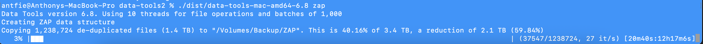

# Data Tools

Disclaimer: I will not be responsible for any data loss caused by this tool.

If you have a ton of copies of files, backups of backups, and are drowning in duplicate data, then consider using Data Tools to 'ZAP' it all. This program will ultimately place a single instance of every file you have in a single location and all the references are stored in a SQLite database. You can see an example of this below:

# Configuration

# Running Order

1. `crawl /some/path`
1. `hash`
1. `zap`
1. `unzap`

# ZAP-ing

When you ZAP your files, every unique file is placed in a folder and all duplicate copies are removed.

Note that empty folders will not be created when un-ZAP-ping, should you desire to re-inflate your disk drive.

## How Can I Support This?

We welcome fixes, features and donations.